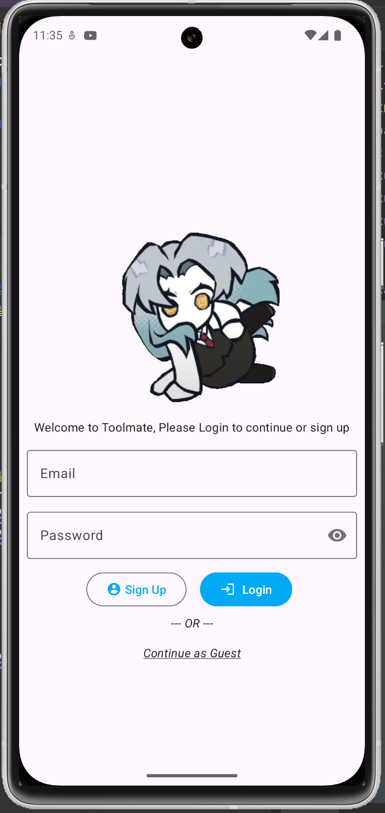
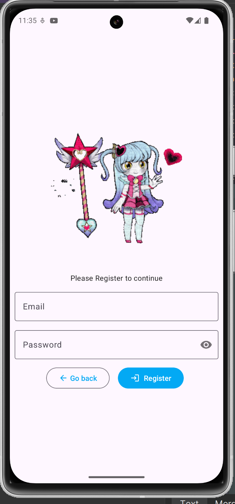
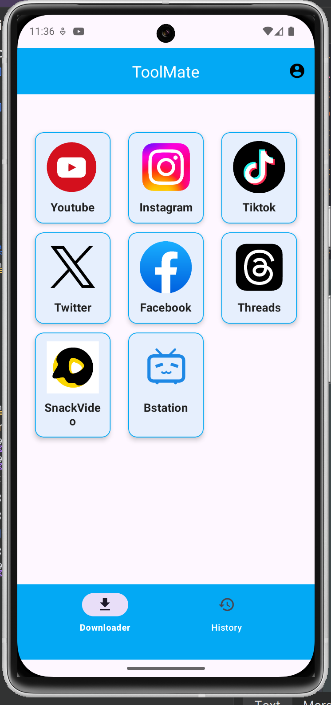
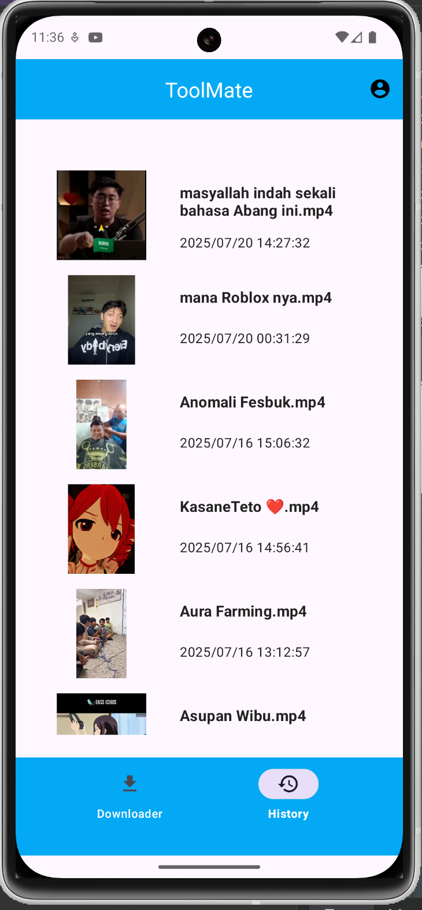
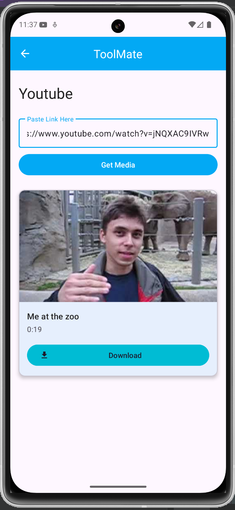
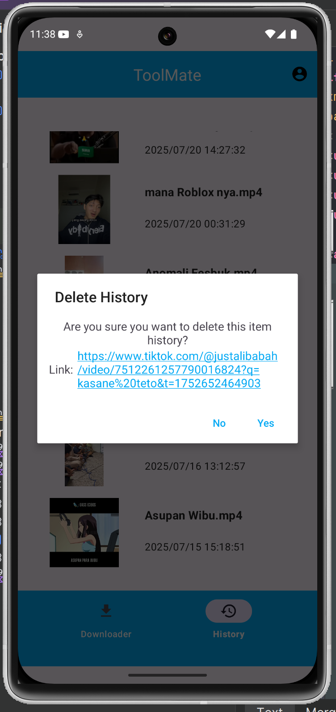

<div align="center">


# ToolMate

</div>

# Screenshots

<div align="center">
<div>






</div>
</div>
<hr>
 
# Media Downloader for Android

ToolMate adalah sebuah aplikasi Android yang dirancang untuk menjadi solusi terpusat dalam mengunduh konten media dari berbagai platform sosial populer. Proyek ini dibangun sepenuhnya secara *native* menggunakan Kotlin dan menerapkan prinsip-prinsip pengembangan Android modern. Dibuat sebagai proyek pribadi untuk tujuan pembelajaran dan eksplorasi.

## Fitur Utama

-   **Dukungan Multi-Platform**: Unduh video dan gambar dari platform seperti YouTube, Instagram, TikTok, Twitter, Facebook, Threads, SnackVideo, dan Bstation.
-   **Pratinjau Media**: Lihat *thumbnail*, judul, dan detail media lainnya sebelum memutuskan untuk mengunduh.
-   **Autentikasi Pengguna**: Sistem login dan registrasi menggunakan Firebase Authentication untuk pengalaman yang dipersonalisasi. Opsi untuk masuk sebagai tamu (*guest*) juga tersedia.
-   **Riwayat Unduhan**: Semua aktivitas unduhan disimpan secara lokal (menggunakan Room) dan disinkronkan ke Cloud Firestore, memastikan riwayatmu aman dan dapat diakses.
-   **Manajemen Riwayat**: Hapus riwayat unduhan satu per satu atau beberapa sekaligus (*bulk delete*).
-   **UI Modern & Simpel**: Antarmuka yang bersih dan intuitif dibangun dengan Material Design 3.

## Teknologi & Arsitektur

Proyek ini dibangun dengan *tech stack* yang relevan dengan industri saat ini:

-   **Bahasa**: **Kotlin** (100% Native)
-   **Arsitektur**: **MVVM** (Model-View-ViewModel) dengan `ViewModel`, `LiveData`, dan `Repository Pattern`.
-   **UI**: **View Binding**, **Material Design 3**, `RecyclerView`, dan `CardView`.
-   **Navigasi**: **Jetpack Navigation Component** untuk alur navigasi antar-layar yang mulus.
-   **Networking**: **Retrofit2** & **OkHttp3** untuk melakukan panggilan API ke *third-party service*.
-   **Database Lokal**: **Room** untuk menyimpan riwayat unduhan secara *offline* (sebagai *cache*).
-   **Backend & Cloud**:
    -   **Firebase Authentication**: Untuk manajemen pengguna.
    -   **Cloud Firestore**: Sebagai *database* utama untuk menyimpan riwayat unduhan yang terikat dengan akun pengguna.
-   **Image Loading**: **Glide** untuk memuat *thumbnail* gambar secara efisien.
-   **Dependency Management**: **Gradle** dengan **Version Catalog** (`libs.versions.toml`).

## Cara Kerja

1.  **Input URL**: Pengguna memilih platform dari *dashboard* dan memasukkan URL media yang ingin diunduh.
2.  **Fetching Media**: Aplikasi menggunakan *class* `MediaFetcher` yang spesifik untuk setiap platform (misal: `YoutubeMediaFetcher`).
3.  **API Call**: `MediaFetcher` melakukan panggilan ke API eksternal (`api.fasturl.link`) menggunakan Retrofit untuk mendapatkan detail media.
4.  **Tampil Pratinjau**: Hasil respons dari API (berupa JSON) di-*parsing* menggunakan GSON ke dalam *data class* dan ditampilkan di UI (thumbnail, judul, dll.).
5.  **Proses Unduh**: Saat pengguna menekan tombol *download*, aplikasi menggunakan `DownloadManager` bawaan Android untuk mengunduh file di *background* secara andal.
6.  **Simpan Riwayat**: Informasi unduhan (nama file, tanggal, thumbnail) disimpan ke database Room lokal dan disinkronkan ke koleksi Firestore pengguna.

## Cara Menjalankan Proyek

1.  **Clone Repository**
    ```bash
    git clone https://github.com/Zabduziz/Toolmate.git
    ```
2.  **Buka di Android Studio**
    -   Impor proyek ke Android Studio. Biarkan Gradle melakukan *sync*.

3.  **Setup Firebase**
    -   Proyek ini memerlukan koneksi ke Firebase.
    -   Buat proyek baru di [Firebase Console](https://console.firebase.google.com/).
    -   Tambahkan aplikasi Android baru dengan *package name* `com.example.toolmate`.
    -   Aktifkan **Authentication** (Email/Password & Anonymous) dan **Firestore Database**.
    -   Unduh file `google-services.json` dari pengaturan proyek Firebase dan letakkan di dalam direktori `app/`.

4.  **Build & Run**
    -   Jalankan aplikasi pada emulator atau perangkat Android fisik.

## Disclaimer

Aplikasi ini dibuat untuk **tujuan edukasi dan pembelajaran saja**. Pengguna bertanggung jawab penuh atas konten yang diunduh. Jangan gunakan aplikasi ini untuk aktivitas yang melanggar hak cipta atau ilegal.
